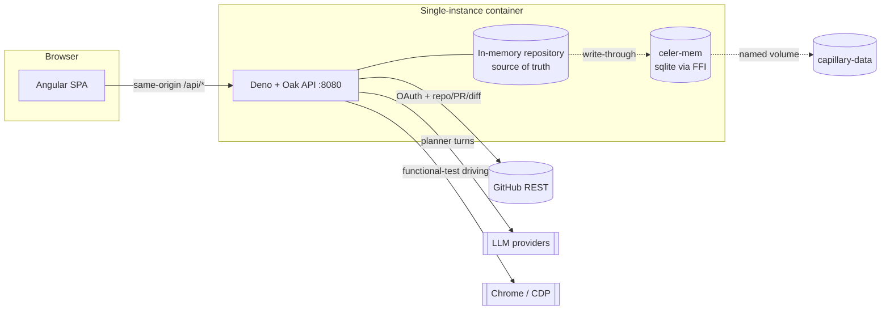
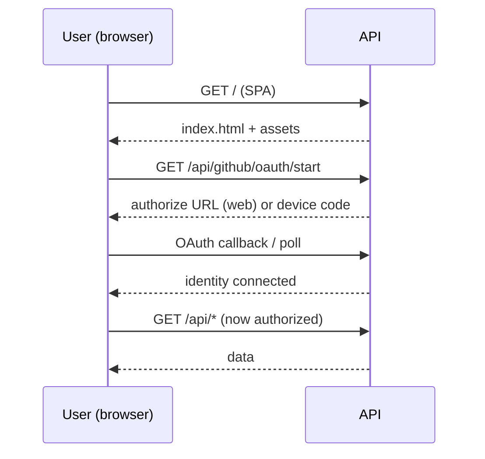
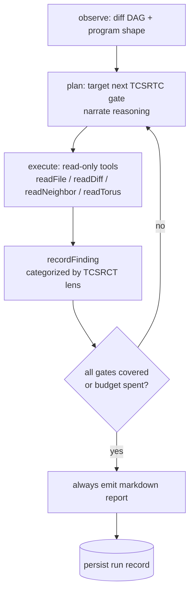
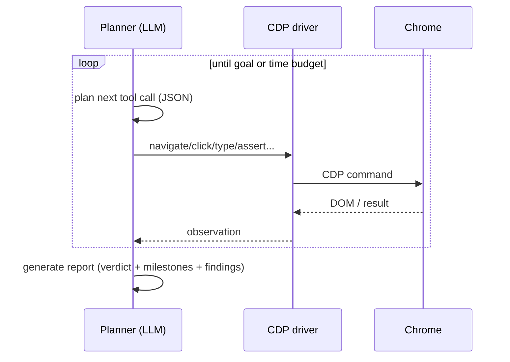
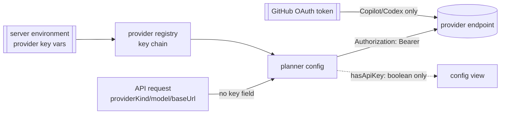

# Capillary — Architecture & Design Flow

Capillary is a graph-immersive pull-request review system. It projects a PR's
change surface onto a dependency graph and a torus shape field, ranks risk,
and drives an agentic, tool-using code review through the six TCSRTC gates
(Target → Constrain → Sanitize → Review → Test → Confirm) that produces an
exportable report. A second agent drives a real browser over the Chrome
DevTools Protocol (CDP) to run natural-language functional tests against the
running web app.

This document describes the system topology, the request/deployment surface,
the two agent flows, the provider transport layer, storage, and the security
posture. It is the map for consuming and operating Capillary.

---

## 1. System at a glance

- **API** — Deno + Oak (TypeScript), single process, listens on `:8080`.
- **Web** — Angular 20 (standalone components, signals, `OnPush`). Built to
  static assets and served by the API in a single-instance deploy.
- **Durable memory** — `celer-mem`, a sqlite-backed embedded store reached over
  a small C ABI FFI shim. Optional; the in-memory repository is the source of
  truth and the store is a write-through mirror.
- **Topology** — deliberately **single instance**. The in-memory repository is
  the synchronous source of truth; there is no horizontal-scaling story and none
  is intended. Durability is provided by the local store + a docker-managed
  named volume.

---

## 2. Deployment & request surface

Capillary ships as one container that serves the built SPA and the API from the
same origin. See [README.md](README.md) and
[docker-compose.yml](docker-compose.yml).

- **Registry-first**: `docker compose up -d` runs the published image
  (`CAPILLARY_IMAGE`, default `ghcr.io/solesius/capillary-cr:latest`). `make docker-up`
  builds locally (UID/GID-mapped for host-owned volumes).
- **Auth gate**: with `CAPILLARY_REQUIRE_GITHUB_LOGIN=1`, every `/api/*` route
  except the GitHub OAuth handshake requires a connected identity.
- **Static SPA**: with `CAPILLARY_SERVE_WEB=1`, non-`/api/` paths are served from
  `CAPILLARY_WEB_DIST` with SPA fallback to `index.html`.
- **Health**: `GET /healthz` is unauthenticated and sits ahead of the login
  gate; it backs the Docker `HEALTHCHECK` and any orchestrator probe.
- **Origin safety**: `CORS_ORIGIN` is a comma-separated allow-list. Mutating
  requests (`POST/PUT/PATCH/DELETE`) carrying a non-allow-listed `Origin` are
  rejected with `403 origin_not_allowed` (CSRF floor). Requests with no `Origin`
  (curl, server-to-server, tests) are permitted.

---

## 3. GitHub identity & source access

Handled by `GitHubOakService` ([api/src/services/github_service.ts](api/src/services/github_service.ts)).

- **Two login modes**: web callback flow (client id + secret) and device flow
  (client id only). A Personal Access Token / `GITHUB_TOKEN` is also accepted.
- **Reads**: repositories, pull requests, and **real PR diffs** (unified
  patches). `getRepoFileContent` fetches file bodies (graceful `null` on missing
  token / path traversal / oversized / network error).
- **Secret handling**: the connected token lives in memory only and is **never**
  persisted to the durable store, never echoed, never logged.

---

## 4. The review pipeline (graph → shape → risk → agent)

A review run streams typed events (SSE) — `run_start`, `phase`, `graph`,
`log`, `thinking`, `tool`, `finding`, `cycle`, `report`, `done` — through
ordered phases defined in
[api/src/domain/review_phase.ts](api/src/domain/review_phase.ts):
`queued → diff_dag → program_shape → tcsrct → llm_provider → llm_merged →
completed`.

1. **diff DAG** — the PR diff becomes a dependency DAG
   ([diff_dag_service.ts](api/src/services/diff_dag_service.ts)).
2. **dependency wetting** — changed nodes propagate influence to neighbors.
3. **torus shape projection** — nodes are embedded on a torus of revolution
   (R = 2.4, r = 0.8) by
   [graph_math_service.ts](api/src/services/graph_math_service.ts) using real
   differential geometry, not decorative trig. Placement is semantic: a node's
   major-ring angle (φ) is a stable FNV-1a hash of its file path, and its
   minor-ring angle (θ) is its **disturbance** (0.55·state + 0.45·interop
   magnitude, signed by hemisphere) — disturbed nodes migrate toward the
   inner-rim saddle, the region of negative Gaussian curvature. Per-node risk
   telemetry is the Euler normal curvature κ_n(α) = κ₁cos²α + κ₂sin²α and
   geodesic torsion τ_g(α) = (κ₂ − κ₁)sinα·cosα along the node's flow angle
   (directional imbalance + coupling), normalized against the surface's
   analytic extrema. The web app renders this embedding live in a WebGL
   viewport as soon as the DAG lands, mid-run.
4. **risk surfaces** — `deriveRiskSurfaces` ranks files. Risk is dominated by
   fundamentals (change magnitude, blast radius/degree, neighbor risk) with
   torus geometry as a **secondary** modulator; config files (Makefiles, CMake,
   `.mk`, etc.) are deprioritized.
5. **agentic TCSRTC review** — an autonomous, tool-using agent walks the six
   TCSRTC Feature Process gates: **Target → Constrain → Sanitize → Review →
   Test → Confirm**.

### 4a. Agentic review loop

Orchestrated by `AgenticReviewService`
([agentic_review_orchestrator_service.ts](api/src/services/agentic_review_orchestrator_service.ts)),
which constructs a `ReviewAgentService`
([review_agent_service.ts](api/src/services/review_agent_service.ts)) internally.
Decision logic is pure and unit-tested
([agentic_review_logic.ts](api/src/services/agentic_review_logic.ts)).

Each cycle the planner targets the next uncovered **TCSRTC gate**, narrates
its reasoning (streamed live as `thinking` events with gate attribution),
calls read-only tools (each call carries a `reason`, streamed as `tool`
events), and records findings. Findings are categorized under the six
**TCSRCT analysis lenses** — Trace, Contracts, State, Runtime, CodeShape,
Tests — which are orthogonal to the gates: gates are *where the agent is in
the process*, lenses are *what kind of defect a finding is*. `cycle` events
report gate coverage, which drives frontend progress.

- **Report always produced**: every run emits a structured markdown report (LLM
  when available, deterministic fallback otherwise) via a `report` event, and
  persists a run record including the model that ran it (`provider/model`).
  Reports are anchored to **file paths** — internal node ids and raw geometry
  telemetry (curvature/torsion numbers) never appear in prose. Verdict maps
  blocker/high → `request_changes`, else `comment`, else `approve`.
- **Post summary to PR (opt-in)**: a completed run can be posted back to the
  pull request as a comment via
  `POST /api/review/runs/:runId/pr-comment` — verdict, summary,
  finding/file/cycle counts, and the model used. Gated behind an explicit
  button in the UI; nothing is written to GitHub automatically.
- **Tracing (opt-in)**: `trace=true` retains the full per-step trace +
  screenshots and enables a dependency-free **zip export** (report + run JSON +
  findings + trace + capture manifest). Untraced runs persist report + metadata
  only.

---

## 5. The functional-test agent (RetV over CDP)

`CdpRetvAgentService`
([cdp_retv_agent_service.ts](api/src/services/cdp_retv_agent_service.ts)) drives
a real Chrome instance to execute natural-language functional tests against the
running web app, via `CdpDriverService`
([cdp_driver_service.ts](api/src/services/cdp_driver_service.ts)).

- **Tools**: `navigate, waitForSelector, click, type, extractText, assertText,
  evaluate, readPage`.
- **Loop**: wall-clock bounded (`RETV_AGENT_MAX_DURATION_MS`, default 10 min);
  `maxCycles` is an optional hard cap. Natural stops: `goal_achieved`,
  `drift_pause`, `no_progress_pause`, `step_failed`; else
  `time_budget_exhausted`.
- **Output**: same "always a report, opt-in trace + zip export" contract as the
  review agent, persisted as RetV run records.

---

## 6. Provider transport layer

All model access flows through a provider registry
([providers/provider_registry.ts](api/src/services/providers/provider_registry.ts))
and pluggable transports. Provider kinds:

| Kind | Transport | Auth |
| --- | --- | --- |
| `codex_app_server` | JSON-RPC over stdio (spawns `codex app-server`) | Codex CLI login — **no key** |
| `claude_code` | stdio (`claude` CLI, stream-json) | Claude CLI OAuth — **no key** |
| `github_copilot` | GitHub Models / Copilot REST | connected **GitHub OAuth** token |
| `anthropic` / `openrouter` / `gemini` / `ihhi_bedrock` | HTTPS REST | provider API **env** key |
| `openai_compatible` | OpenAI-style REST | env key; **operator-set base URL** |

- **stdio-first**: Codex and Claude Code are the recommended paths — the model
  credential never enters Capillary.
- **Container → host passthrough**: a containerized API can use the host's
  CLI logins. Run the stdio↔WebSocket bridge on the host and point the
  container at it (compose already maps `host.docker.internal` via
  `host-gateway`):
  - Codex: [api/scripts/codex_ws_bridge.ts](api/scripts/codex_ws_bridge.ts) +
    `CODEX_APP_SERVER_URL=ws://host.docker.internal:7899`
  - Claude Code: [api/scripts/claude_ws_bridge.ts](api/scripts/claude_ws_bridge.ts) +
    `CLAUDE_CODE_URL=ws://host.docker.internal:7898` (the bridge allowlists
    the exact print-mode flag set the transport emits — nothing else spawns)

  Both overrides are env-only — request payloads still cannot repoint the
  providers. GitHub Copilot needs no bridge: it authenticates with the
  connected GitHub OAuth token over REST from anywhere.
- **Reasoning / timeouts**: Codex sessions are pooled per base URL and reuse a
  thread per run context; agent contexts request low reasoning effort and a
  longer turn budget, review contexts use full reasoning (all env-tunable).

---

## 7. Credential & security posture

Capillary treats model credentials as **environment-only** secrets.

- **Keys are never accepted over the wire.** `setPlannerConfig` accepts only
  `providerKind`, `model`, and (for the local provider) `baseUrl`. Every
  provider resolves its key exclusively from the API server environment via the
  registry key chain (`ANTHROPIC_API_KEY`, `OPENROUTER_API_KEY`,
  `GEMINI_API_KEY`, `GITHUB_COPILOT_TOKEN`/`GITHUB_TOKEN`, fallback
  `CAPILLARY_LLM_API_KEY`, …).
- **Base URL pinning.** Documented cloud/CLI providers are fully described by
  their registry defaults — a request cannot repoint them, so a key can never be
  steered to an attacker endpoint. **Only** `openai_compatible` (the local /
  self-hosted provider) honors a request-supplied base URL.
- **TLS floor.** A key-bearing local config using cleartext `http://` to a
  non-loopback host is rejected (`planner_base_url_insecure`); loopback and
  `https/stdio/ws/cli` are exempt.
- **No cross-credential leakage.** The connected GitHub token is only ever sent
  to Copilot / Codex, never to third-party model endpoints.
- **Never persisted / echoed / logged.** Tokens and keys live in memory only;
  `getPlannerConfig` exposes `hasApiKey: boolean` and nothing more. The durable
  store holds no identity, token, or key fields.
- **CSRF/SSRF floor.** Origin allow-list + mutating-method origin check (§2).

---

## 8. Storage & persistence

- **Source of truth**: `InMemoryReviewRepository`
  ([repositories/review_repository.ts](api/src/repositories/review_repository.ts)).
- **Durable mirror**: `DurableReviewStore`
  ([services/storage/celer_review_store.ts](api/src/services/storage/celer_review_store.ts))
  write-through mirrors runs, events, findings, packets, graphs, checklists, and
  RetV/review agent run records into `celer-mem`. All writes are best-effort and
  never throw into the request path; `loadSnapshot()` rehydrates on boot.
- **Enablement**: durability turns on only when `CAPILLARY_STORAGE_DIR` is set
  **and** the native FFI library loads; otherwise the process runs fully
  in-memory.
- **celer-mem FFI**: built by [api/native/build.sh](api/native/build.sh) into
  `libceler_ffi.so` (sqlite-only; the only system dependency is `sqlite3`).
  celer-mem sources are not vendored — the script fetches the canonical
  [Solesius/celer-mem](https://github.com/Solesius/celer-mem) repo at a pinned
  ref (`CELER_MEM_GIT_REF`, see Dockerfile), or uses a local checkout via
  `CELER_MEM_DIR`.

---

## 9. Configuration reference

Environment variables are documented in [.env.example](.env.example). The most
load-bearing ones:

| Variable | Purpose |
| --- | --- |
| `CAPILLARY_IMAGE` | Published image to run (registry-first) |
| `CAPILLARY_PORT` | Host port (container always `:8080`) |
| `CORS_ORIGIN` | Comma-separated browser origin allow-list (CORS + CSRF) |
| `CAPILLARY_REQUIRE_GITHUB_LOGIN` | Gate `/api/*` behind a connected identity |
| `CAPILLARY_SERVE_WEB` / `CAPILLARY_WEB_DIST` | Serve the built SPA |
| `CAPILLARY_STORAGE_DIR` | Enable durable `celer-mem` storage |
| `GITHUB_OAUTH_CLIENT_ID` / `_SECRET` / `_REDIRECT_URI` / `_SCOPES` | GitHub login |
| `CAPILLARY_LLM_API_KEY` + provider-specific keys | Model credentials (env only) |
| `CDP_BASE_URL` / `CHROME_PATH` | Functional-test browser endpoint |

---

## 10. Build, test, publish

| Task | Command |
| --- | --- |
| API type-check | `cd api && deno check src/main.ts` |
| API tests | `cd api && deno task test` |
| Web build | `cd web && npm run -s build` |
| Web unit tests | `cd web && npm test` |
| Local container | `make docker-up` |
| Publish to GHCR | `make image-push OWNER=<org> REPO=<repo> TAG=v0.1.0` |

CI runs the API + web suites on every PR
([.github/workflows/ci.yml](.github/workflows/ci.yml)); tagged releases
publish the image to GHCR
([.github/workflows/publish-image.yml](.github/workflows/publish-image.yml)).
